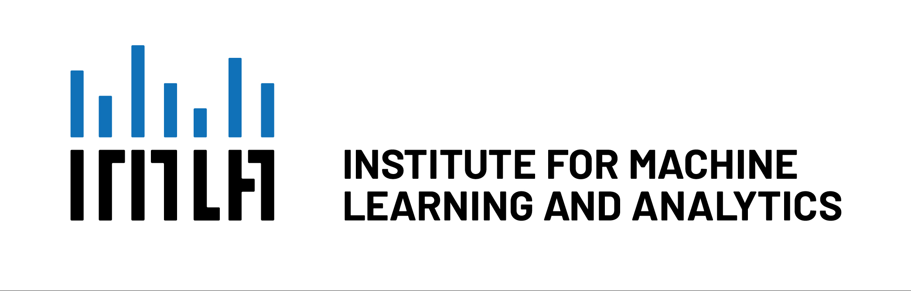

# KI-Sommerschule

<table>
<tr>
<td></td>
<td></td>
</tr>
</table>

Das ***[Institute for Machine Learning and Analytics (IMLA)](https://imla.hs-offenburg.de)*** an der Hochschule Offenburg veranstaltet auch dieses Jahr wieder eine gemeinsame **KI-Sommerschule** mit der ***[Akademie der Ev. Landeskirche Baden](https://www.ekiba.de/akademie-baden/)***. 

## Termin Mo 12.9. - Do 15.9.2022
Täglich 9-12.30 Uhr und 13.30-17 Uhr mit Pausen. 

## Modus
In der Sommerschule werden die Grundlagen aktueller KI und Machine Learning-Methoden vermittelt werden. Dabei legen wir großen Wert auf Praxisnähe! Knapp 50% des Kurses bestehen aus praktischen Übungen anhand von konkreten Aufgaben aus der Praxis.

### Covid-19-Maßnahmen und Regeln
Derzeit planen wir mit einer Präsenzveranstaltung nach der 3G-Regel, d.h. Teilnehmer müssen geimpft, genesen oder getestet sein. Sollten sich die Rahmenbedingungen bis zum Kurs ändern, ist auch ein Wechsel auf ein reines Online-Format möglich. 

### Veranstaltungsorte
Der Kurs wird an der HS Offenburg durchgeführt. Kursräume und Anfahrtsbeschreibungen werden den Teilnehmern rechtzeitig mitgeteilt.

## Zielgruppe
Zielgruppe sind Mitarbeiterinnen und Mitarbeiter aus Fachabteilungen oder der IT-Abteilung von Unternehmen, die über IT-Kenntnisse und grundlegende Programmierkenntnisse verfügen. Der Kurs ist für Einsteiger im Bereich KI / Machine Learning ausgelegt. 

## Dozenten

### Prof. Dr. Klaus Dorer (HS Offenburg)
Klaus Dorer ist Leiter des Labors Autonome Systeme an der Hochschule Offenburg. Er leitet bzw. wirkt mit an verschiedenen Projekten zum Thema maschinelles Lernen wie dem Projekt Menschen Lernen Maschinelles Lernen (ML2), dem Projekt Magma, bei dem simulierte Fußballroboter lernen Fußball zu spielen (amtierende Vizeweltmeister), dem Projekt Sweaty, bei dem ein echter humanoider Roboter Fußball spielt (amtierender Weltmeister).

### Prof. Dr.-Ing. Janis Keuper (HS Offenburg)
Janis Keuper leitet das "Institute for Machine Learning and Analytics" (IMLA) an der HS Offenburg. Seine Forschungsgebiete liegen in den Bereichen "Large Scale Machine Learning" / Big Data, Generativen Lernmethoden und der Sicherheit und Robustheit von KI Verfahren. In den Kurs wird er seine langjährige Erfahrung aus einer Vielzahl von Industrieprojekten mit einem sehr breiten Anwendungsspektrum einbringen.

### Pfr. Dr. phil. Gernot Meier (Ev. Landeskirche Baden / Evangelische Akademie)
Gernot Meier ist Kulturwissenschaftler und Pfarrer der Evangelischen Landeskirche in Baden. Er ist stlv. Akademiedirektor / Studienleiter und Beauftragter für Ethik und Theologie der Digitalisierung, sowie Lehrbeauftragter im Zentrum für europäische Geschichts- und Kulturwissenschaften der UNI Heidelberg. Im ILMA des HSO befasst er sich mit Fragen zur digitalen Kultur und der sog. digitalen Ethik / Maschinenethik.

### Prof. Dr. Daniela Oelke (HS Offenburg)
Daniela Oelke ist Professorin für Maschinelles Lernen an der Hochschule Offenburg. Ihr Forschungsschwerpunkt liegt im Bereich der Visuellen Datenanalyse und der Erklärbaren Künstlichen Intelligenz, außerdem beschäftigt sie sich mit der automatischen Verarbeitung natürlicher Sprachen.

## Vorläufiges Programm
### 1. Tag
* Einführung
* Grundlegende Konzepte
* Machine Learning mit KNIME

### 2. Tag
* Algorithmen zur Klassifikation und Regression
* Unüberwachtes Lernen
* Ethik, Digtialisierung und KI  

### 3. Tag
* Hackathon / "hands-on" Projekt

### 4. Tag
* Deep Learning

## Anmeldung / Kosten
Die Teilnahme am Kurs ist gebührenfrei. Auf Grund der begrenzten Teilnehmerzahl werden wir bei zu vielen Anmeldungen aber ein Auswahl treffen müssen. Beispielsweise kann die maximale Anzahl an Teilnehmern einer Firma festgelegt werden.

### [-> ONLINE ANMELDUNG](https://events.hs-offenburg.de/e/ki-sommer) 
* die Teilnehmerzahl ist auf 20 beschränkt (Warteliste) 
* **Anmeldeschluß: 1.9.** 

## FAQ
* **Welche Programmierkenntnisse werden vorausgesetzt?** Grundlegende Kenntnisse und Erfahrungen im Umgang mit einer Programmiersprache wie Python, Java, C/C++, Matlab sind vorteilhaft, aber aufgrund der Verwendung des Tools KNIME keine zwingende Voraussetzung.

* **Kann ich auch nur an Teilen des Kurses teilnehmen?** Eher nicht. Die einzelnen Module bauen aufeinander auf und Teilnehmer sollten an allen Modulen teilnehmen. Im Einzelfall kann natürlich mal ein Modul aus terminlichen Gründen ausgelassen werden.

## Impressum / Kontakt
Prof. Dr.-Ing. Janis Keuper  
Institute for Machine Learning and Analytics (IMLA)  
Hochschule Offenburg  
Badstr. 24  
77652 Offenburg  
info@ki-sommer.de  
